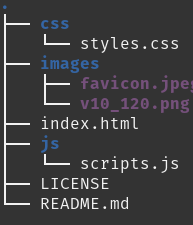

# WebDev-ECOI35
> ### Link da Aplicação: [Link](https://stupefied-mirzakhani-9a56f8.netlify.app/)
> Link do site da Harmonicanto: [Harmonicanto](http://www.harmonicanto.org.br/)
# Ferramentas
>  JavaScrip, HTML, CSS, Bootstrap, Git, GitHub, Netlfy
# Proposta
A proposta consiste na criação de uma página de campanhas que a ONG faz, como de Natal, início de aulas, para poderem ter maior gestão e versatilidade com o gerenciamento das campanhas, sendo assim foi criada uma página para cadastrar essas campanhas, e também um formulário para o doador se fidelizar, ou apenas deixar seus dados se doar uma única vez, pois hoje a ONG não tem controle de quem está doando, não conseguindo assim entrar em contato com essas pessoas.
# Estrutura do projeto
